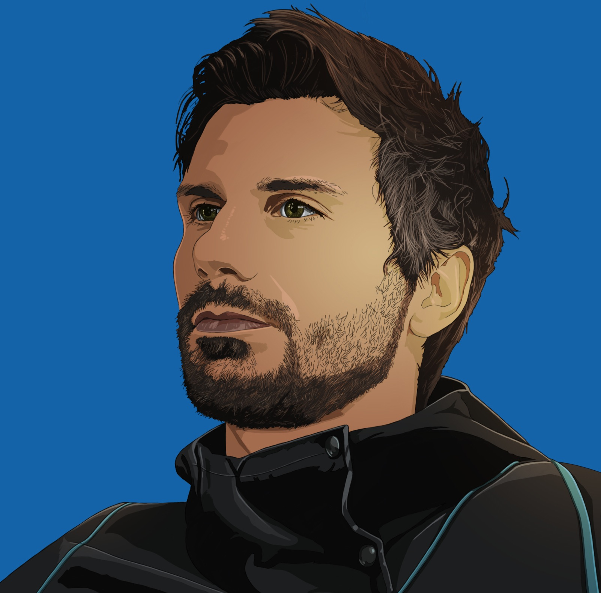

{:.about-image :height="250px" width="250px"}

Hi everyone!

I am Matteo, and most of my time I am a videogame engineer. I am Italian, I was born and raised in Rome, later I moved to England and now I live in Brighton along the south-east coast.

Since very young I have always found computers fascinating, videogames in particular, wondering about who were the creators of those incredibly beautiful pieces of art like Tetris, Pong, Prince of Persia, Donkey Kong, Street Fighter, Metal Gear Solid and the list goes on and on. Hence, I enrolled in a Computer Engineering university course in Università Roma Tre, where I obtained a Bachelor and subsequently a Master of Science degrees, specialising in Graphic Rendering. During that time I've also had a fantastic experience studying for one year in the University of Glasgow as part of Erasmus exchange. Afterwards, with the objective of focusing on videogames, I have applied and won a scholarship for a MSc in Computer Games Technology in Abertay University in Dundee, where I graduated with distinction.

After finishing my studies, I was lucky enough to land a job in NaturalMotion's Boss Alien studio in Brighton, and I could not have entered the game industry from a better door. At Boss Alien I was part of the development team behind hit mobile games such as CSR Racing and CSR Classics, as well as participating in other yet unreleased projects. Then, I have worked at King London studio for almost 3 years, where I have been involved with different projects and worked in some of their multimillion dollars live titles, like Farm Heroes and Farm Heroes Super Saga, as well as being involved in the development of shared libraries and engine middleware solving common technical challenges and running functional programming courses and workshops. Lately, I moved out of the mobile space on to triple AAA videogames development for PC and console platforms, and currently I am working at Studio Gobo on a yet unreleased new IP.

When I am not creating or playing videogames, researching functional programming or working on various projects, you can find me kitesurfing in Camber Sands, skateboarding around Brighton's colourful streets, riding my Triumph Bonneville T120 or travelling somewhere around the world! Or eating pizza. 🍕

You can download my up-to-date resume [here](https://docs.google.com/document/d/1muXM6M9kqN3bVmMhUh3fF_A9fEMr6FRRkmToSfd0-UU/edit?usp=sharing).
