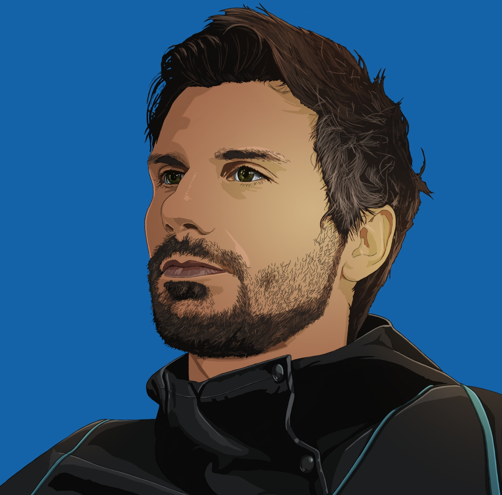

{:height="250px" width="250px"}

Hi — I’m Matteo. I build videogames by day and catch whatever sleep my family allows by night. I’m based in Brighton on England’s south‑east coast, originally from Rome, and I’ve studied and worked across the UK.

I’m a videogame engineer focused on gameplay systems, tooling, with a taste for elegant, pragmatic code and the occasional functional‑programming trick, as well with a hidden passion for computer graphics and computational theory. I cut my teeth in the videogame industry making mobile games at [Boss Alien](https://www.bossalien.com/) working on CSR Racing and CSR Classics, spent almost three years at [King](https://king.com/) contributing to large live titles and shared middleware, and now I’m at [Studio Gobo](http://www.studiogobo.com/) helping create a new AAA IPs for PC and consoles.

My academic path started with a BSc and MSc in Computer Engineering (specialising in computer graphics) from [Università Roma Tre](http://www.uniroma3.it/corsi/dipartimento-di-ingegneria/l/2018-2019/ingegneria-informatica-0580706200800002/), included an Erasmus year at the [University of Glasgow](https://www.gla.ac.uk/schools/computing/), and continued with an MSc (Distinction) in Computer Games Technology at [Abertay University](https://www.abertay.ac.uk/course-search/postgraduate-taught/computer-games-technology), where I studied on a scholarship.

When I’m not shipping features, you’ll find me training Brazilian Jiu‑Jitsu, kitesurfing at Camber Sands, riding my Triumph Bonneville, travelling, eating pizza — and parenting three very demanding tiny humans.

You can download my up-to-date resume [here](https://docs.google.com/document/d/1muXM6M9kqN3bVmMhUh3fF_A9fEMr6FRRkmToSfd0-UU/edit?usp=sharing).
