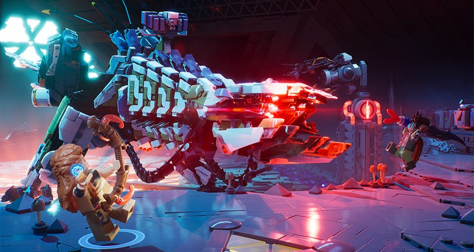
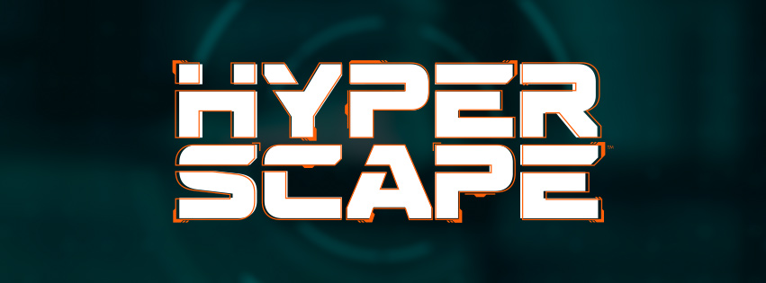
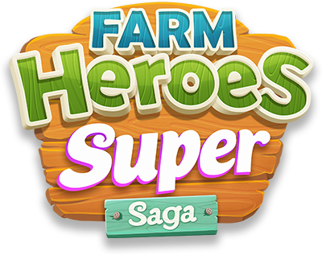
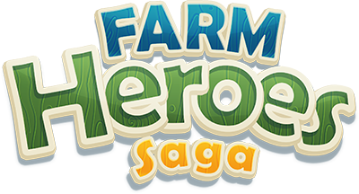
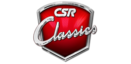

# Projects

The following list contains the most relevant projects I have worked on professionally.

## Lego Horizon Adventures

Join machine hunter Aloy as she leads a colourful crew of heroes through the lush wilderness on a quest to save the world and learn the secrets of her past. Dive into boundless adventure, customise to your heart’s content, and take on action-packed battles solo or with friends

[Lego Horizon Adventures on Playstation.com](https://www.playstation.com/en-gb/games/lego-horizon-adventures/)

## Hyper Scape

Hyper Scape is a free-to-play first-person shooter battle royale game developed by Ubisoft Montreal and published by Ubisoft for Microsoft Windows, PlayStation 4 and Xbox One. The game is notable for its integration with video game live streamers which allows viewers on Twitch to affect the outcome of a match. Engage in close-quarters, fast-paced and vertical matches to become the next global Battle Royale superstar.

[Hyper Scape](https://en.wikipedia.org/wiki/Hyper_Scape)

## Farm Heroes Super Saga

These Cropsies are not big, they’re SUPER! Match your way across heaps of levels full of Farmtastic fun, plus new game modes!

[Farm Heroes Super Saga](https://king.com/game/farmheroessupersaga)

## Farm Heroes

Could you be a Farm Hero? Rancid the Racoon is trying to spoil the precious Farm Lands, stealing as many Cropsies as he can along the way. Will you join forces with the Farm Heroes and help to collect the Cropsies and save the day? Play through hundreds of levels of switching and matching farming fun to find out!

[Farm Heroes](https://king.com/game/farmheroes)

## CSR Classics

NaturalMotion, maker of CSR Racing, delivers another excellent drag-racing experience with CSR Classics. Featuring a streamlined approach to this high-octane sport, CSR Classics is a fast, focused, and highly polished game that lets you collect, restore, and then race dozens of historic cars.

[CSR Classics](https://itunes.apple.com/us/app/csr-racing/id469369175)

## CSR Racing

With its console-quality looks and streamlined controls, NaturalMotion’s gorgeous drag racer delivers a deep automotive experience. It starts with more than 85 world-famous cars, each ready to customize to perfection in your quest to rule the streets. From multiplayer matches to smoking rival racing gangs, new challenges wait around every corner.

[CSR Racing](https://itunes.apple.com/us/app/csr-classics/id598603610)
