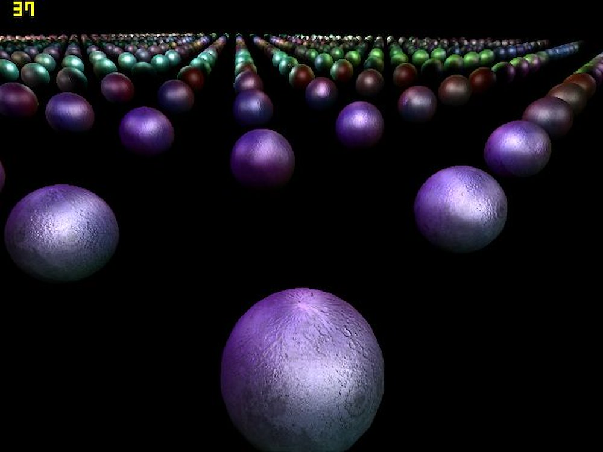
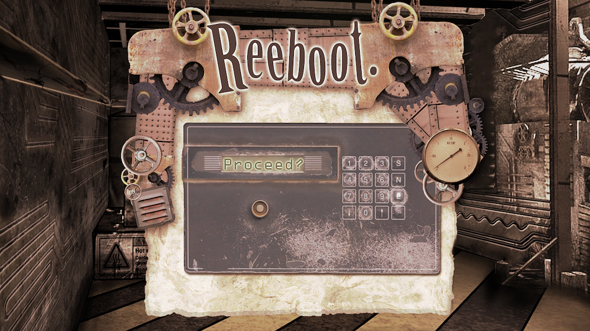
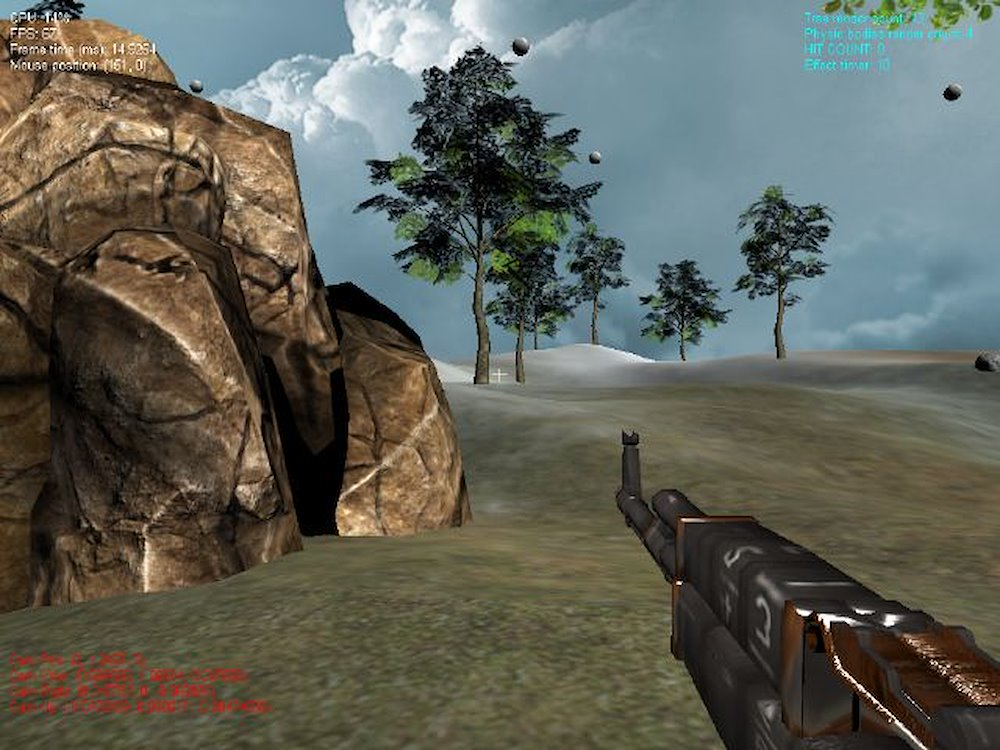
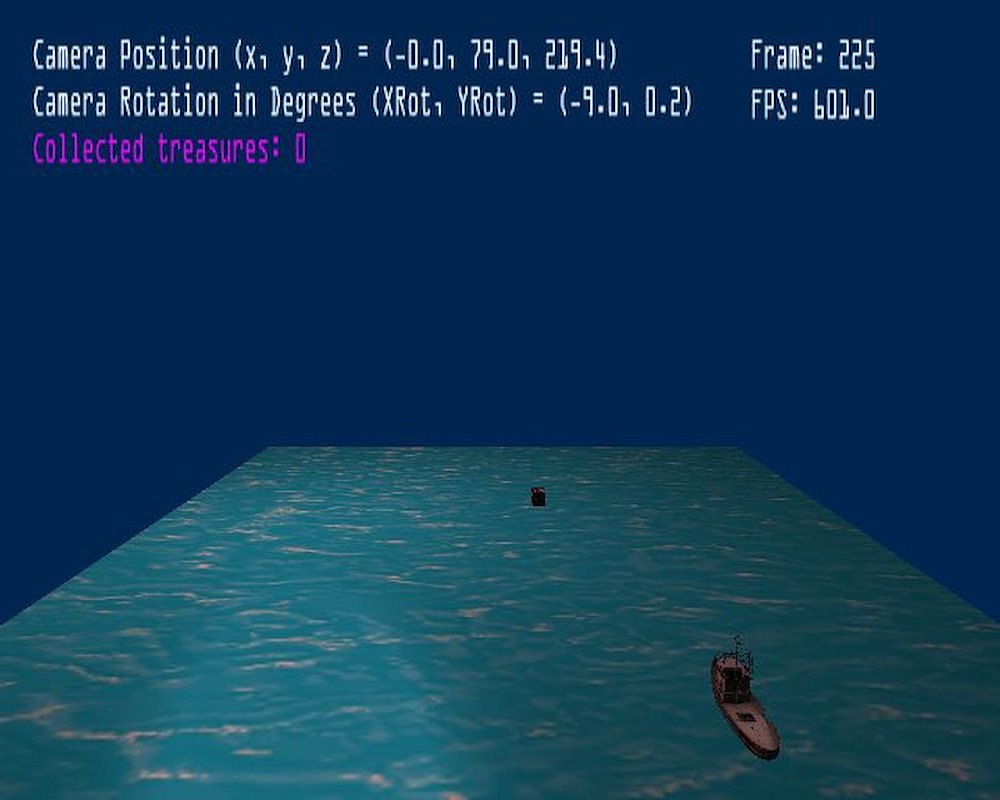
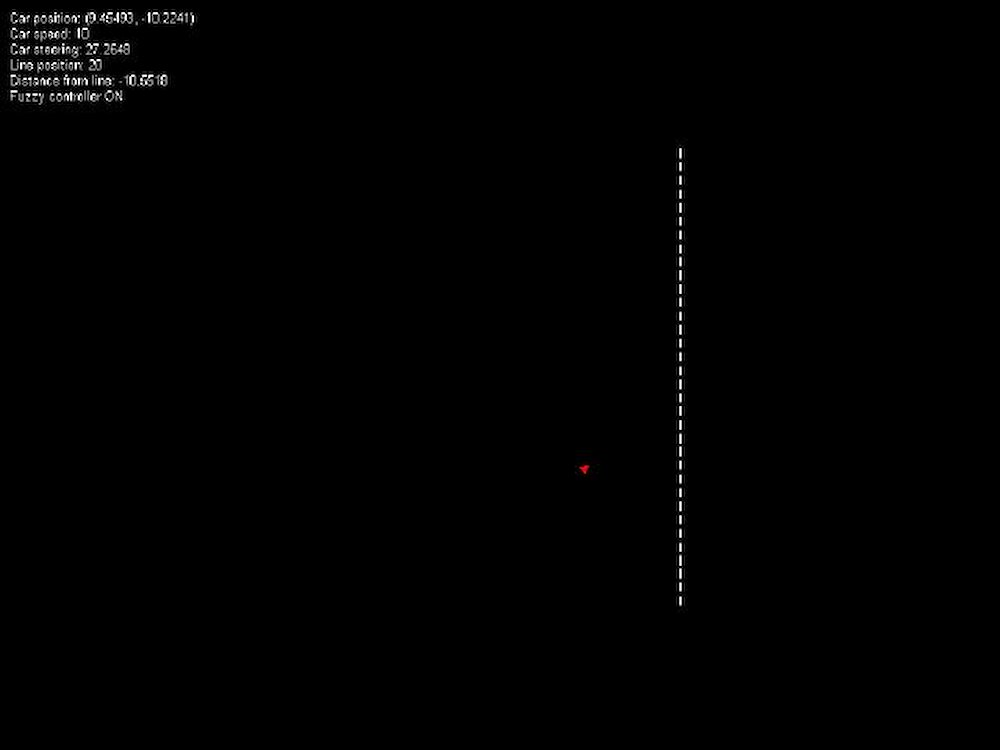

# Miscellanea

These are random things I have worked on or projects from university days.

## Glue

A library implemententing useful category theory concepts for functional programming in Scala.

[Gihub Repository](https://github.com/matteomeli/glue)

## MSc/PGDip dissertation: Evolution of lighting techniques in videogames

Dynamic lighting is a key aspect for real time rendering applications such as video games. This study aims to provide a detailed comparison of lighting techniques.

## Reeboot

Team project at Abertay University using Sony's Phyre Engine for PS3. Worked in a small team to create a PC/PS3 game powered by PhyreEngine’s game engine.

## Game Programming Course Demo

This demo was created to demonstrate knowledge of the DirectX 10 graphics API. The simple game includes advanced features such as physics and post-processing effects.

[Youtube Video](http://youtu.be/P6ms3Y7_M_U)

## PS2 Programming Course Demo

This game was created to demonstrate understanding of PlayStation2 platform and Vector Unit programming.

## AI demo: Fuzzy Logic experiments

This application shows a “car” that follows a path driven by a fuzzy logic based steering engine.

[Youtube Video](http://youtu.be/2TwjbZTExNo)

## BenchGL

Web rendering made easy! BenchGL is a WebGL framework for general purpouse web rendering, data visualization and graphic application development.

[Website](http://webrendering.sourceforge.net/)
